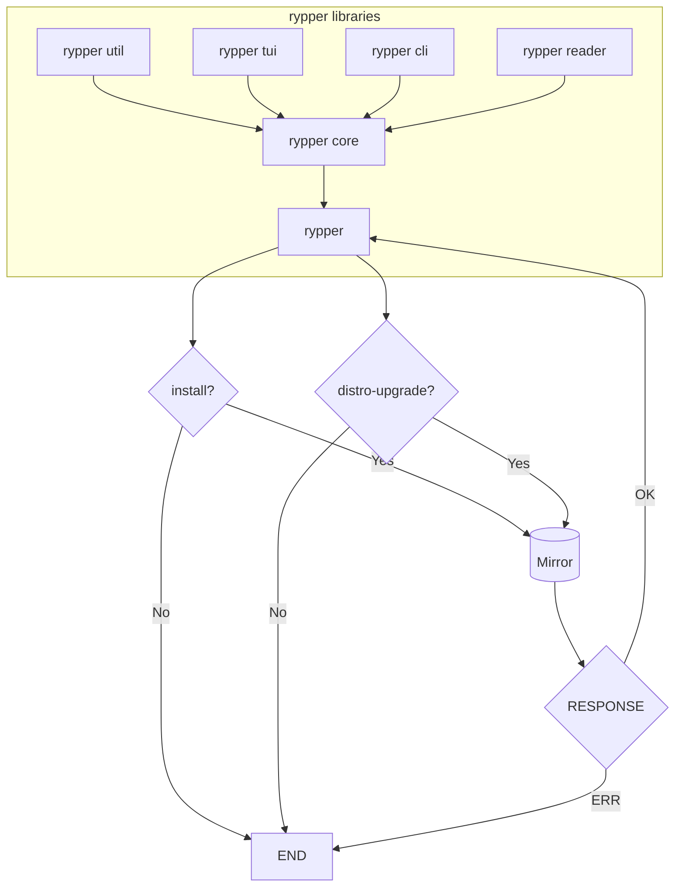

# Architecture

This document details different components of the code base. The intention is to provide
a simple to explain but a high-level description of the projects goals and plans
to each of these internal mechanisms.



## CLI (rypper-cli)

The `cli` is the frontend for running commands behind the scenes. The goal is to make it
readable, and to make it as close as `zypper`'s cli commands.

The following commands that are planned to be close to `zypper` are the following:

- `install` (aliased as `in`)
- `remove` (aliased as `rm`)
- `update` (aliased as `update`)
- `distro-upgrade` (aliased as `dup`)
- `addrepo` (aliased as `ar`)
- `removerepo` (aliased as `rr`)
- `addlock` (aliased as `al`)
- `removelock` (aliased as `rl`)
- `modifyrepo` (aliased as `mr`)

Other commands related to services seems to be not planned for now.

## Reader (rypper-reader)

The reader handles all the metadata that is fetched from upstream. These includes
but not limited to the following:

- Repo files. They are actually in `ini` format. Example:

	```ini
	[Publishing]
	name=Publishing Tools and Libraries (openSUSE_Tumbleweed)
	type=rpm-md
	baseurl=https://download.opensuse.org/repositories/Publishing/openSUSE_Tumbleweed/
	gpgcheck=1
	gpgkey=https://download.opensuse.org/repositories/Publishing/openSUSE_Tumbleweed/repodata/repomd.xml.key
	enabled=1
	```

- XML Metadata from repo files. They contain data of all available packages in that repo.
- Signature verification. They use GPG. I cannot avoid it though ☺️

## Utilities (rypper-utils)

The utilities contains all helper/handler functions and stuff that are used around the project.

## Core (rypper-core)

Bundles everything except for plugins. I plan to have a plugin system.

<!--TODO: Write about how to have a good relationship with mirrors, mirrorcache, file requests, and also how to prioritize
mirrors based on weight -->

