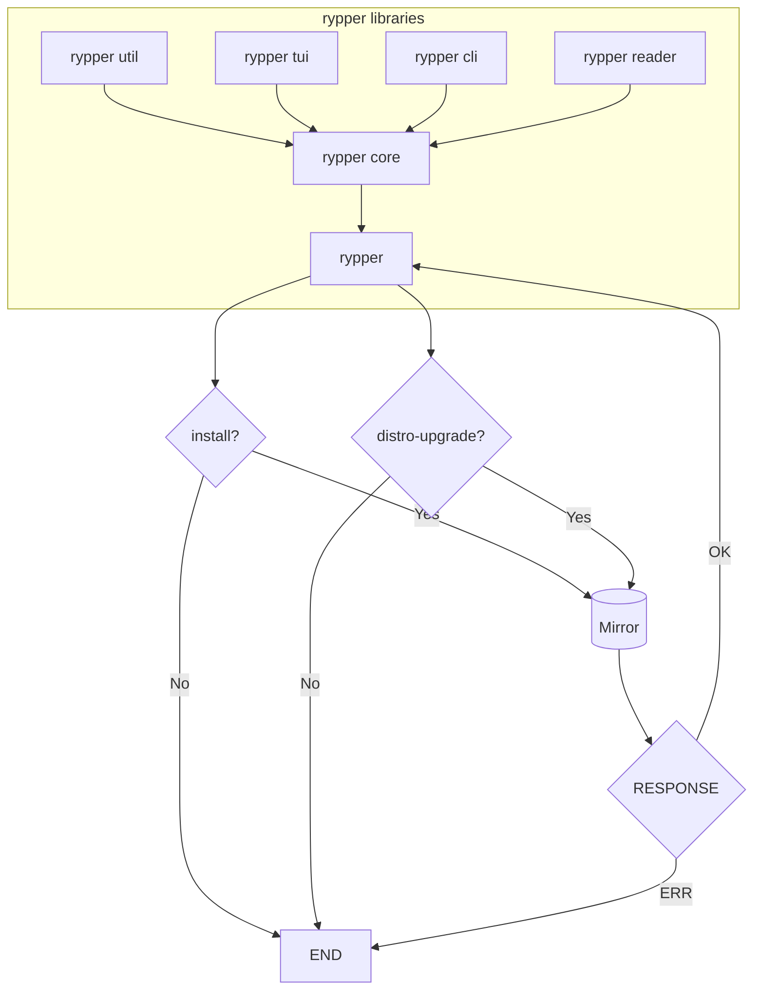

# Architecture

This document details different components of the code base. The intention is to provide
a simple to explain but a high-level description of the projects goals and plans
to each of these internal mechanisms.



## CLI (rypper-cli)

The `cli` is the frontend for running commands behind the scenes. The goal is to make it
readable, and to make it as close as `zypper`'s cli commands.

The following commands that are planned to be close to `zypper` are the following:

- `install` (aliased as `in`)
- `remove` (aliased as `rm`)
- `update` (aliased as `update`)
- `distro-upgrade` (aliased as `dup`)
- `addrepo` (aliased as `ar`)
- `removerepo` (aliased as `rr`)
- `addlock` (aliased as `al`)
- `removelock` (aliased as `rl`)
- `modifyrepo` (aliased as `mr`)

Other commands related to services seems to be not planned for now.

## Reader (rypper-reader)

The reader handles all the metadata that is fetched from upstream. These includes
but not limited to the following:

- Repo files. They are actually in `ini` format. Example:

	```ini
	[Publishing]
	name=Publishing Tools and Libraries (openSUSE_Tumbleweed)
	type=rpm-md
	baseurl=https://download.opensuse.org/repositories/Publishing/openSUSE_Tumbleweed/
	gpgcheck=1
	gpgkey=https://download.opensuse.org/repositories/Publishing/openSUSE_Tumbleweed/repodata/repomd.xml.key
	enabled=1
	```

- XML Metadata from repo files. They contain data of all available packages in that repo.
- Signature verification. They use GPG. I cannot avoid it though ☺️

## Utilities (rypper-utils)

The utilities contains all helper/handler functions and stuff that are used around the project that *may not fit in some rypper libraries*.

## Core (rypper-core)

Core functionaliy that bundles all other rypper libraries. The logic are finally wrapped around in this library.

<!--TODO: Write about how to have a good relationship with mirrors, mirrorcache, file requests, and also how to prioritize
mirrors based on weight -->


# Mirrors vs Mirrorcache

<!--TODO: Finish researching about this one -->
Mirrors are essential for every Linux distribution. In openSUSE, packages, software and libraries are built around from what is
called as Open Build Service or for short, OBS (not the Open Broadcasting Software). Packages go there to be built and thoroughly
checked through openQA. If a package successfully builds in OBS, it will then be pushed into a Mirror such as https://download.opensuse.org/. 
Once there, it can be downloaded as an RPM package using a package manager e.g. `zypper`.

Therefore, a mirror is basically a "place" where packages are hosted for a Linux distribution to be installed from or updated. But what is
openSUSE's MirrorCache interface?

As defined by their description of their [project on GitHub](https://github.com/openSUSE/MirrorCache), it's a redirector. There are many mirrors
that host packages for various distributions around the world including openSUSE's. An example to check if you are in a mirror redirector
is to run:

This will give you a metalink version 4 file. It lists the mirrors that are available and closest to you based on region
```sh
curl -H "Accept: application/metalink4+xml"  https://mirrorcache-au.opensuse.org/tumbleweed/repo/oss/repodata/repomd.xml
```

```sh
curl -L -H "Accept: */*"  https://mirrorcache-au.opensuse.org/tumbleweed/repo/oss/repodata/repomd.xml
```

```sh
curl -H "Accept: */*"  https://mirrorcache-au.opensuse.org/tumbleweed/repo/oss/repodata/repomd.xml
```

<!--NOTE: Mirrorcache is a misnomer. It's actually a "redirector" -->

# CDN (RIS)

New architecture from openSUSE? or for openSUSE? 

